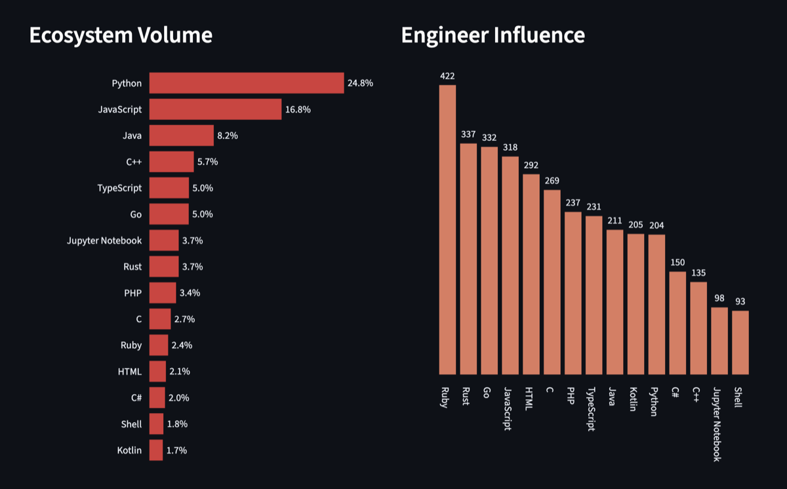
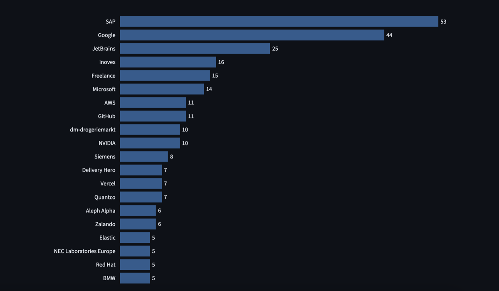
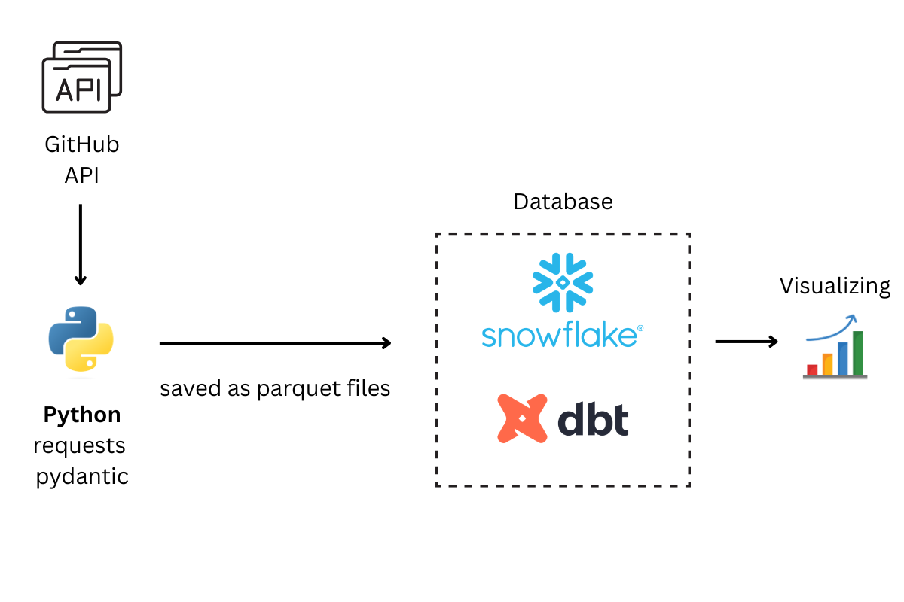

# ⛏️ GitHub Talent Miner ✨
Because of unemployement and curiosity I made a data engineering project that scrapes public GitHub profiles across German cities, and transforms the raw data into clean, analysis-ready tables — answering questions like *which companies employ the most engineers* and *which programming languages dominate the tech scene*.

> **3,000+ developer profiles** scraped across Heidelberg, Karlsruhe, Munich, and Berlin.

---
## RESULTS


*Figure 1: On the left average followers per developer with his main language.*


*Figure 2: Most common companies that employ people*

---

## Architecture



---

## What it does

### 1. Extraction (`src/github_miner.py`)
- Searches GitHub's public API for developers by city (`location:Berlin` etc.)
- For each developer found, makes two additional enrichment calls:
  - `GET /users/{login}` — fetches `company`, `location`, `bio`, `followers`
  - `GET /users/{login}/repos` — fetches public repos to determine primary programming language
- Validates every profile against a **Pydantic schema** before writing to disk
- Saves raw JSON + validated Parquet files, partitioned by date and city
- Handles GitHub API rate limits (5,000 req/hour) with configurable sleep.

### 2. Loading (Snowflake + SnowSQL)
- Parquet files are staged via `PUT` into a Snowflake internal stage
- Loaded into a raw table via `COPY INTO` with explicit column mapping
- Raw table preserves original data exactly as received — no transforms at load time

### 3. Transformation (dbt)
- **Staging model** cleans the raw data:
  - Strips `@` prefix from company names (`@google` → `Google`)
  - Normalizes inconsistent company names (`SAP SE` → `SAP`, `inovex GmbH` → `inovex`)
  - Extracts city from raw location string (`"Berlin, Germany"` → `"Berlin"`)
  - Filters out universities and research institutions
  - Deduplicates by developer ID keeping the most recent record
- **Mart models** aggregate the clean data into analysis-ready tables by company, city, and language
- **dbt tests** enforce data quality on every run (`unique`, `not_null`, `accepted_values`)

### 4. Visualization (Streamlit)
- Multi-page interactive dashboard connecting directly to Snowflake marts
- **Companies page** — bar chart of top companies by developer count, filterable
- **Languages page** — language popularity + average followers per language as a proxy for engineer influence

---

## Tech Stack

| Layer | Tool |
|---|---|
| Extraction | Python, requests, Pydantic |
| File format | Apache Parquet (via pandas) |
| Data warehouse | Snowflake |
| Transformation | dbt Core 2.0 |
| Visualization | Streamlit, Plotly |
| Language | Python 3.9+ |

---

## Setup & Running

### Prerequisites
- Python 3.9+
- Snowflake account (free trial works)
- GitHub Personal Access Token (no scopes needed — public data only)
- dbt Core 2.0 + dbt-snowflake adapter

### 1. Clone and install dependencies

```bash
git clone https://github.com/your-username/github-talent-miner.git
cd github-talent-miner
python -m venv venv
source venv/bin/activate
pip install -r requirements.txt
```

### 2. Configure environment variables

```bash
cp .env.example .env
# fill in your GitHub token and Snowflake credentials
```

Required variables:

```
GITHUB_TOKEN=ghp_...
SNOWFLAKE_ACCOUNT=xy12345.us-east-1
SNOWFLAKE_USER=your_username
SNOWFLAKE_PASSWORD=your_password
```

### 3. Set up Snowflake

Run the setup SQL in Snowsight or SnowSQL to create the warehouse, database, schema, file format, stage, and raw table. See `sql/setup.sql`.

### 4. Run the extraction

```bash
python src/github_miner.py
```

Fetches developers for configured cities (default: Heidelberg, Karlsruhe, Munich, Berlin) and saves Parquet files to `data/processed/`.

**Note on rate limits:** GitHub allows 5,000 authenticated API requests per hour. At 2 enrichment calls per developer × 500 developers per city, each city takes roughly 15-20 minutes. The script includes configurable sleep between cities.

### 5. Load to Snowflake

```sql
USE DATABASE TALENT_MINER_DB;
USE SCHEMA RAW;

PUT file:///path/to/data/processed/2026-07-05_berlin.parquet @LATEST_DEV_UPLOADS;

COPY INTO TALENT_MINER_DB.RAW.GITHUB_DEVELOPERS
  (id, login, html_url, score, type, ingested_at, company, location,
   followers, public_repos, bio, primary_language, top_languages)
FROM (
  SELECT
    $1:id::INT, $1:login::STRING, $1:html_url::STRING,
    $1:score::FLOAT, $1:type::STRING, CURRENT_TIMESTAMP(),
    $1:company::STRING, $1:location::STRING, $1:followers::INT,
    $1:public_repos::INT, $1:bio::STRING,
    $1:primary_language::STRING, $1:top_languages::STRING
  FROM @LATEST_DEV_UPLOADS
)
FORCE = TRUE;
```

### 6. Run dbt

```bash
cd dbt_transformation
dbt run      # builds all models
dbt test     # runs data quality checks
```

### 7. Launch the Streamlit dashboard

```bash
cd streamlit_app
streamlit run Home.py
```

Opens at `http://localhost:8501`.

---

## Data Quality

dbt tests run automatically on every `dbt run`:

- `id` — unique and not null across all developer profiles
- `login` — not null
- `type` — only `User` or `Organization` (catches API anomalies)
- `followers` — not null
- `company` (mart) — unique per row, not null
- `city` (mart) — unique per row, not null

---

## What I Learned

This project covered the full data engineering stack from scratch:
- Designing a multi-call API extraction pipeline with rate limit handling and retry logic
- Pydantic for schema validation at the extraction layer
- Snowflake internals: SQL ,stages, file formats, `COPY INTO`, schema design
- dbt's staging/marts pattern and why separating raw from clean data matters
- Writing dbt tests to enforce data quality automatically
- Building an interactive Streamlit dashboard on top of a live data warehouse
